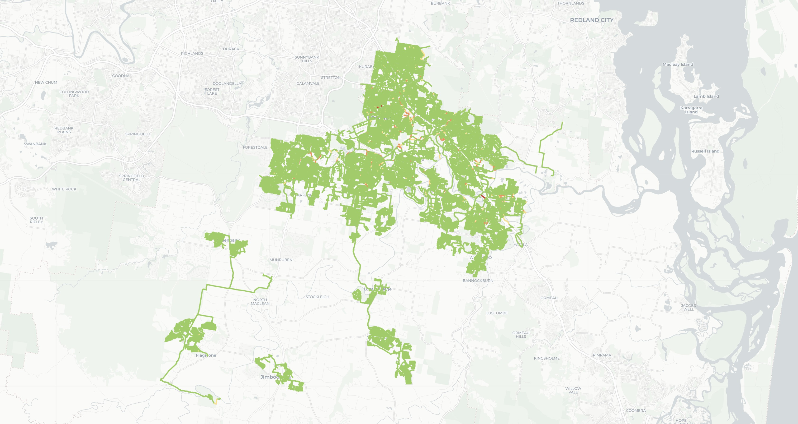

# Tree Root Intrusion Sewer Pipe Risk Scoring System

A GIS-based, open-data framework for scoring and mapping tree-root-intrusion risk across a municipal sewer network, so that inspection and renewal budgets can be targeted proactively instead of reactively.

**Case study:** Logan City, South East Queensland, Australia — 72,683 unique gravity and pressure sewer segments across 58 suburbs.

<p align="center">
  
</p>

---

## Table of Contents

- [1. Problem Statement and Proposal](#1-problem-statement-and-proposal)
- [2. What This System Does](#2-what-this-system-does)
- [3. Methodology](#3-methodology)
- [4. Repository Structure](#4-repository-structure)
- [5. Data Requirements](#5-data-requirements)
- [6. Installation](#6-installation)
- [7. Configuration](#7-configuration)
- [8. Usage](#8-usage)
- [9. Output Schema](#9-output-schema)
- [10. Example Results](#10-example-results)
- [11. Interactive Map](#11-interactive-map)
- [12. Known Limitations](#12-known-limitations)
- [13. Roadmap](#13-roadmap)
- [14. Contributing](#14-contributing)
- [15. License](#15-license)
- [16. Citation](#16-citation)

---

## 1. Problem Statement and Proposal

Tree root intrusion is the single most common cause of sewer pipe blockage and structural failure in urban wastewater networks. It is well documented internationally — from AU$2.3M/year spent by South Australia's water utility on reactive root removal, to root damage reported in 20–26% of sewer mains in at least one Australian regional network — yet most utilities still manage it reactively: crews respond after a blockage or CCTV inspection flags a defect, rather than being directed toward the assets most likely to fail next.

The literature is consistent that root intrusion risk is driven by a *combination* of factors — pipe age, pipe material and joint type, and proximity to woody vegetation — but a recent systematic review found **no published predictive model that combines vegetation/environmental data with standard pipe-condition data** using only data a utility is likely to already have.

**This project proposes and implements a practical answer to that gap:** a reproducible geoprocessing pipeline that combines a utility's own GIS asset register with two free, public datasets (OpenStreetMap land cover and government suburb boundaries) to produce a defensible, per-pipe risk score — with no proprietary tree survey, LiDAR canopy model, or CCTV history required as a prerequisite. The goal is a **first-pass triage layer**: a fast, transparent, zero-marginal-cost way to rank tens of thousands of pipe assets so that limited inspection budgets go to the right suburbs and the right pipes first.

## 2. What This System Does

Given a utility's sewer pipe shapefiles, this system:

1. Merges and de-duplicates gravity and pressure main asset records.
2. Attributes every pipe to a suburb/locality via spatial join.
3. Buffers each pipe to approximate its root-influence corridor and measures overlap with mapped vegetation (OpenStreetMap).
4. Derives a pipe-age index from recorded (or defaulted) construction year.
5. Derives a pipe-material susceptibility index from a literature-informed weighting table.
6. Combines the three indices into a single **0–100 composite risk score** per pipe.
7. Aggregates results to suburb level (mean/max risk, highest-risk asset per suburb).
8. Renders an interactive, colour-coded Folium web map for exploration.

## 3. Methodology

### 3.1 Data preparation

- Gravity (`Sewer_Pipe_Non_Pressure.shp`) and pressure (`Sewer_Pipe_Pressure.shp`) main layers are merged into one GeoDataFrame and reprojected to a local projected CRS (`EPSG:28356`, GDA94 / MGA Zone 56) for accurate distance/area calculations.
- True duplicate records (identical `Asset_ID` **and** geometry) are dropped.
- Each pipe is spatially joined to a suburb boundary layer; where a pipe crosses more than one boundary, the suburb with the **longest geometric overlap** is assigned.

### 3.2 Vegetation Proximity Index

- Each pipe is buffered by `BUFFER_DISTANCE_M` (default **5 m**) to represent the near-pipe root-influence corridor.
- OpenStreetMap vegetation polygons are queried via `osmnx` (`natural=wood/tree_row/scrub/grassland`, `landuse=forest/grass/meadow/orchard/vineyard`, `leisure=park/garden/nature_reserve`) and dissolved into a single union geometry.
- `foliage_mean_density` = (buffered corridor area ∩ vegetation) / (buffered corridor area), a continuous value in `[0, 1]`.
- A separate, coarser 10 m corridor analysis (all pipes dissolved into one buffer) is also provided as a network-wide sanity check.

### 3.3 Pipe Age Index

- `PIPE_AGE_YEARS` = current year − `CONSTRUCTED_YEAR`.
- Where construction date is missing, a default of `DEFAULT_CONSTRUCTED_YEAR = 1980` is applied and the record is flagged (`YEAR_ESTIMATED = True`) so imputed values can be identified or excluded downstream.

### 3.4 Pipe Material Susceptibility Index

Each material code is normalised (trimmed, upper-cased) and mapped to a weight:

| Risk tier | Materials | Weight |
|---|---|---|
| High | Vitrified clay / earthenware (`VC`, `EW`) | 1.5 |
| High | Reinforced concrete (`RCP`, `CONC`, `RC`) | 1.4 |
| High | Asbestos cement (`AC`, `FRC`) | 1.3 |
| Medium | Cast iron (`CI`) | 1.2 |
| Medium | Mild steel / ductile iron (`MS`, `DI`, `DICL`) | 1.1 |
| Low | GRP / FRP composite | 0.8 |
| Low | PVC variants (`PVC`, `UPVC`, `PVC-U/O/M`) | 0.7 |
| Low | Polyethylene (`PE`, `HDPE`, `PE-100/80B`) | 0.6 |
| Neutral | Unknown / not recorded | 1.0 |

### 3.5 Composite Risk Score

All three indices are min–max normalised to `[0, 1]` across the network, then combined:

```
RISK_SCORE = round(
    (foliage_norm * 0.40 +
     age_norm     * 0.35 +
     material_norm * 0.25) * 100,
    2
)
```

Weights (40% vegetation / 35% age / 25% material) are set from qualitative literature emphasis, **not** statistically fitted — see [Known Limitations](#12-known-limitations).

### 3.6 Aggregation and Visualisation

- Suburb-level summary: pipe count, mean risk, max risk, and the top-risk `Asset_ID` per suburb.
- Network-wide ranking of the top-N highest-risk individual pipes.
- Interactive Folium map, colour-coded:
  - 🟢 `< 60` — Low
  - 🟡 `60–69` — Elevated
  - 🟠 `70–79` — High
  - 🔴 `≥ 80` — Critical

## 4. Repository Structure

```
.
├── treeroot_intrusion_sewer_pipe_risk_scoring_system.ipynb   # end-to-end pipeline notebook
├── data/
│   ├── Sewer_Pipe_Non_Pressure.shp[.dbf/.shx/.prj]           # gravity mains (not included — see §5)
│   ├── Sewer_Pipe_Pressure.shp[.dbf/.shx/.prj]                # pressure mains (not included — see §5)
│   └── queensland-boundaries-localities-suburbs.geojson       # suburb/locality boundaries (open data)
├── outputs/
│   ├── sewer_risk_map.html                                    # interactive Folium risk map
│   └── top_100_risk_pipes.csv                                 # (optional export) highest-risk assets
├── map1.jpg                                                    # static preview of the risk map
├── docs/
│   └── Tree_Root_Intrusion_Risk_Scoring_Logan_City.docx        # full write-up / technical paper
└── README.md
```

## 5. Data Requirements

| Layer | Format | Required fields | Source |
|---|---|---|---|
| Gravity sewer mains | Shapefile (line) | `Asset_ID`, `MATERIAL` (or `MAT`), `CONSTRUCTI` (construction date) | Utility GIS asset register |
| Pressure sewer mains | Shapefile (line) | Same as above | Utility GIS asset register |
| Suburb/locality boundaries | GeoJSON (polygon) | Locality name column (`locality`, or auto-detected) | State/local open data portal |
| Vegetation land cover | Queried live | — | OpenStreetMap via `osmnx` |

> **Note:** Utility asset shapefiles are typically not open data and are **not included in this repository**. Point `DATA_DIR` at your own exports before running the notebook. Field names above match the Logan City dataset used in the case study; adjust the column-detection logic in the notebook if your utility uses different schema conventions.

## 6. Installation

```bash
git clone https://github.com/<your-username>/treeroot-sewer-risk-scoring.git
cd treeroot-sewer-risk-scoring

python -m venv .venv
source .venv/bin/activate      # Windows: .venv\Scripts\activate

pip install geopandas pandas numpy shapely osmnx folium contextily rasterio rasterstats matplotlib
```

| Package | Purpose |
|---|---|
| `geopandas` | Vector data I/O, spatial joins, buffering, overlay |
| `osmnx` | Querying OpenStreetMap vegetation/land-cover features |
| `shapely` | Geometry union/intersection operations |
| `pandas` / `numpy` | Tabular processing, normalisation, scoring |
| `folium` | Interactive web map output |
| `contextily` | Static basemap tiles for matplotlib figures |
| `rasterio` / `rasterstats` | Optional raster-based zonal statistics (exploratory) |
| `matplotlib` | Static exploratory plots |

Tested with Python 3.10+.

## 7. Configuration

All key parameters are declared at the top of the pipeline for easy adjustment:

```python
CRS_PROJECTED = "EPSG:28356"      # local projected CRS — change for your region
CRS_WGS84 = "EPSG:4326"

USE_SYNTHETIC_PLACEHOLDER = False # set True to test with synthetic vegetation data
BUFFER_DISTANCE_M = 5             # root-influence corridor width (metres)
DEFAULT_CONSTRUCTED_YEAR = 1980   # imputed value for missing construction dates

MATERIAL_RISK_WEIGHTS = { ... }   # see §3.4
OSM_VEGETATION_TAGS = { ... }     # OpenStreetMap tags used to define "vegetation"
```

**Before running on a new network:** set `CRS_PROJECTED` to a locally appropriate equal-area/equal-distance CRS, and extend `MATERIAL_RISK_WEIGHTS` to cover any material codes specific to your asset register.

## 8. Usage

Run the notebook cells in order (see `treeroot_intrusion_sewer_pipe_risk_scoring_system.ipynb`):

1. **Load & deduplicate** pipe shapefiles.
2. **Spatial join** to suburb boundaries.
3. **Buffer & fetch vegetation** from OpenStreetMap.
4. **Compute age and material indices.**
5. **Normalise and calculate `RISK_SCORE`.**
6. **Generate suburb-level summary** and top-N risk tables.
7. **Build the interactive map** (`sewer_risk_map.html`).

Minimal reproduction of the scoring step:

```python
gdf_sewer["age_norm"]      = normalize(gdf_sewer["PIPE_AGE_YEARS"])
gdf_sewer["foliage_norm"]  = normalize(gdf_sewer["foliage_mean_density"])
gdf_sewer["material_norm"] = normalize(gdf_sewer["MATERIAL_WEIGHT"])

gdf_sewer["RISK_SCORE"] = np.round(
    (gdf_sewer["foliage_norm"]  * 0.40 +
     gdf_sewer["age_norm"]      * 0.35 +
     gdf_sewer["material_norm"] * 0.25) * 100, 2
)
```

## 9. Output Schema

Each scored pipe segment carries:

| Column | Description |
|---|---|
| `Asset_ID` | Utility asset identifier |
| `SUBURB` | Assigned locality (or `OUT OF BOUNDS / UNKNOWN`) |
| `MATERIAL` | Standardised material code |
| `MATERIAL_WEIGHT` | Weight from Table §3.4 |
| `CONSTRUCTED_YEAR` | Recorded or defaulted construction year |
| `YEAR_ESTIMATED` | `True` if construction year was imputed |
| `PIPE_AGE_YEARS` | Age at time of assessment |
| `foliage_mean_density` | Vegetation overlap ratio, `[0, 1]` |
| `FOLIAGE_DATA_MISSING` | `True` if buffer/OSM query failed |
| `VEGETATION_DATA_SOURCE` | `OSM`, `SYNTHETIC`, or `FAILED` |
| `RISK_SCORE` | Composite score, `0–100` |

## 10. Example Results

From the Logan City case study (72,683 unique segments, 58 suburbs, run against live OSM data):

- Network-wide 10 m buffered corridor: **52.22 km²**, of which **8.76%** intersected mapped vegetation.
- Highest mean-risk suburbs (≥ 40 segments): **Cedar Grove** (45.4), **Woodridge** (35.6, n=1,645), **New Beith** (35.5).
- Highest single-pipe score: **86.11** (Bahrs Scrub) — flagged for attribute verification (missing material/construction data).
- Highest-risk pipes with complete records cluster around **vitrified clay pipes, 41–55 years old, with near-saturated vegetation cover**, concentrated in Woodridge, Beenleigh, Slacks Creek, and Crestmead.
- Lowest-risk suburbs are newer growth-front estates with young plastic pipe networks: **Yarrabilba** (6.1, n=4,273), **Greenbank** (5.8), **Park Ridge** (6.3).

Full suburb-by-suburb breakdown and top-100 pipe rankings are produced by the notebook; a full write-up is included in `docs/`.

## 11. Interactive Map

The notebook exports `sewer_risk_map.html` — a self-contained Folium map with:

- Colour-coded pipes by `RISK_SCORE` band
- Hover tooltip: Asset ID, Suburb, Material, Age, Risk Score
- Click popup: full attribute detail including vegetation density

Open it directly in a browser — no server required.

## 12. Known Limitations

- **Vegetation completeness:** OpenStreetMap land-cover coverage is crowd-sourced and uneven; scattered individual street trees are under-represented relative to mapped parks/reserves, so `foliage_mean_density` is a conservative proxy, not a canopy census.
- **No species- or distance-specific tree data:** risk varies by up to an order of magnitude between tree species and with exact stem distance, neither of which is captured here.
- **Not yet validated** against CCTV inspection or maintenance-incident history — treat `RISK_SCORE` as a prioritisation heuristic, not a calibrated failure probability.
- **Imputed construction dates** (default 1980) can bias the age index for affected records — these are flagged (`YEAR_ESTIMATED`) but not excluded by default.
- **A priori weights** (40/35/25) are literature-informed, not statistically fitted.
- **Gravity and pressure mains are scored together**, despite differing failure modes.

## 13. Roadmap

- [ ] Validate `RISK_SCORE` against real CCTV/maintenance-incident data; explore logistic-regression-calibrated weights.
- [ ] Integrate council street-tree inventories (species, DBH, exact location) where available.
- [ ] Sensitivity analysis on buffer distance and the 1980 default construction year.
- [ ] Separate scoring pathways for gravity vs. pressure mains.
- [ ] Add soil type and seasonal moisture covariates.
- [ ] Package as a CLI / lightweight API (`risk-score --pipes ... --boundaries ... --out ...`) instead of notebook-only execution.
- [ ] Add automated tests and a small synthetic sample dataset for CI.
- [ ] Publish a Streamlit/Dash dashboard on top of `sewer_risk_map.html` for non-technical stakeholders.

Contributions toward any of the above are welcome — see [Contributing](#14-contributing).

## 14. Contributing

Issues and pull requests are welcome. For larger changes (e.g., new risk factors, alternative scoring models), please open an issue first to discuss scope. Please keep notebook cells reproducible (no hard-coded absolute paths) and document any new configuration parameters in this README.

## 15. License

[Add your chosen license here — e.g., MIT, Apache-2.0.] Note that the Logan City sewer asset shapefiles used in the case study are **not redistributed** in this repository; only the code and open-data (OpenStreetMap, Queensland locality boundaries) dependencies are covered by this project's license.

## 16. Citation

If you use this framework, please cite:

```
[Author name(s)]. A GIS-Based Composite Risk Scoring Framework for Prioritising
Tree Root Intrusion Management in Sewer Networks: A Case Study of Logan City,
Queensland, Australia. [Year]. [Repository/DOI link].
```

This work builds on the risk-factor synthesis in:

> Yang, C.; Ahammed, F.; Cameron, D.; Chow, C.W.K. Review of Root Intrusions by Street Trees and Utilising Predictive Analytics to Improve Water Utility Maintenance Strategies. *Sustainability* 2025, 17, 5263. https://doi.org/10.3390/su17125263
